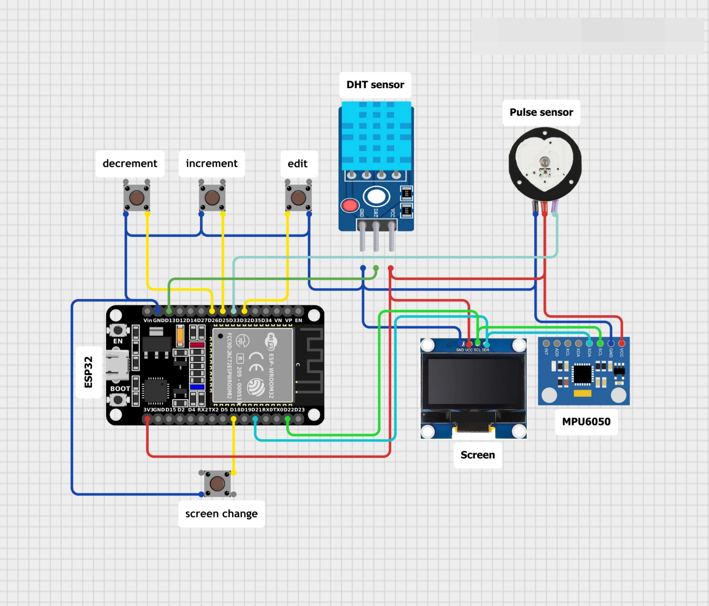

# ESP32 FreeRTOS Smart Watch

## Overview
This project implements a multi-sensor smart watch firmware based on ESP32 and FreeRTOS.  
The system is designed as a real-time embedded application with multiple concurrent tasks handling sensing, processing, networking, and user interface rendering.

The firmware demonstrates professional embedded system design principles such as task separation, inter-task communication, interrupt-driven inputs, and deterministic scheduling.

---
## Table of Contents
1. [Overview](#overview)
2. [Key Features](#key-features)
3. [How to Upload the Code](#how-to-upload-the-code)
   - [For Linux Distros Users](#for-linux-distros-users)
   - [For Windows Users](#for-windows-user)
4. [System Architecture](#system-architecture)
5. [Tasks Overview](#tasks-overview)
6. [Hardware Components](#hardware-components)
7. [Pin Configuration](#pin-configuration)
8. [Inter-Task Communication](#inter-task-communication)
9. [Setup and Build](#setup-and-build)
10. [Design Patterns Used](#design-patterns-used)
11. [Known Limitations and Improvements](#known-limitations-and-improvements)
12. [Project Structure](#project-structure)
13. [References](#references)
---

## Key Features
- Real-Time Operating System (FreeRTOS) based architecture
- Multi-tasking with priority-based scheduling
- RTC with manual date and time editing
- Temperature and humidity monitoring using DHT11
- Motion tracking and step counting using MPU6050
- Heart rate monitoring using an analog pulse sensor
- Weather information via OpenWeather API
- OLED display (SH1106) with button-based UI navigation
- Queue- and semaphore-based inter-task communication

---
## How to upload the code 

Recommended to use *PlatformIO* and *VSCode* to upload the code to the ESP32.

### For Linux distros users

Go to the project directory and write the following commands, and edit your *WiFi* credentials, as well as along with the *openWeatherAPI key*
```
cd lib/credentials
cp credentials_template.h credentials.h
```

### For windows user 

Just use the GUI to make a `lib/credentials/credentials.h` either by copying the template or renaming it. Then update the credentials and the API key. finally upload the code

---

## System Architecture
The firmware follows a producer-consumer architecture:

- Sensor tasks produce data
- Processing tasks analyze sensor data
- Display task consumes processed data and renders UI
- Interrupts signal user input via semaphores

All tasks are managed by the FreeRTOS kernel and pinned to a single ESP32 core for simplified synchronization.

```text
                 ┌──────────────────────┐
                 │        ESP32         │
                 │   FreeRTOS Kernel    │
                 └───────────┬──────────┘
                             │
        ┌────────────────────┼─────────────────────┐
        │                    │                     │
┌───────▼───────┐   ┌────────▼────────┐   ┌────────▼────────┐
│   ISRs        │   │  Sensor Tasks   │   │  Network Tasks  │
│ (GPIO Buttons)│   │                 │   │                 │
└───────┬───────┘   │ readDHT         │   │ OpenWeather API │
        │           │ readPulse       │   │ NTP / RTC Sync  │
        │           │ readMPU         │   └────────┬────────┘
        │           └────────┬────────┘            │
        │                    │                     │
        │        ┌───────────▼───────────┐         │
        │        │   Processing Task     │         │
        │        │  Step Detection       │         │
        │        └───────────┬───────────┘         │
        │                    │                     │
        └──────────────┬─────▼─────────────────────▼────────┐
                       │        FreeRTOS IPC                │
                       │  Queues + Binary Semaphores        │
                       └──────────────┬─────────────────────┘
                                      │
                           ┌──────────▼──────────┐
                           │  screenDisplay Task │
                           │  (UI Renderer)      │
                           └──────────┬──────────┘
                                      │
                           ┌──────────▼──────────┐
                           │   SH1106 OLED       │
                           │   (U8g2 / I2C)      │
                           └─────────────────────┘

```

---

## Tasks Overview

| Task Name            | Priority | Responsibility |
|----------------------|----------|----------------|
| readRTC              | 1        | Timekeeping and manual edits |
| readDHT              | 1        | Temperature and humidity sampling |
| readMPU              | 2        | Accelerometer sampling (100 Hz) |
| stepDetection        | 2        | Step counting algorithm |
| readPulseSensor      | 1        | Heart rate measurement |
| openWeatherGet       | 1        | Weather API communication |
| screenDisplay        | 1        | OLED UI rendering |

---

## Hardware Components
- ESP32 Development Board
- SH1106 OLED Display (I2C)
- DHT11 Temperature and Humidity Sensor
- MPU6050 Accelerometer
- Analog Pulse Sensor
- Push Buttons (UI control)

---

## Pin Configuration

| GPIO | Function |
|-----:|---------|
| 13   | DHT11 Data |
| 18   | Screen Change Button |
| 21   | I2C SDA (OLED + MPU6050) |
| 22   | I2C SCL (OLED + MPU6050) |
| 25   | Increment Button |
| 26   | Decrement Button |
| 32   | Edit Enable Button |
| 33   | Pulse Sensor (ADC) |

<p align="center">
  
</p>

---

## Inter-Task Communication
- Queues are used to safely transfer sensor and processed data between tasks
- Binary Semaphores are used for signaling events from ISRs to tasks
- ISRs are minimal and defer logic to tasks, following FreeRTOS best practices

---

## Setup and Build
1. Install Arduino IDE or PlatformIO
2. Install ESP32 board support
3. Install required libraries:
   - FreeRTOS (ESP32 core)
   - Adafruit Sensor
   - DHT Sensor Library
   - U8g2
   - MPU6050 library
4. Configure Wi-Fi credentials and OpenWeather API key
5. Build and flash the firmware to ESP32

---

## Design Patterns Used
- Producer–Consumer Pattern
- State Machine for UI navigation
- Command Pattern using semaphores
- Adaptive thresholding for step detection

---

## Known Limitations and Improvements
- Time editing overflow handling requires refinement
- Wi-Fi connection lacks timeout handling
- No retry mechanism for failed HTTP requests

Planned enhancements include low-power modes, BLE integration, SD card logging, and advanced motion classification.

---

## Project Structure
- ISRs: Handle button interrupts
- Tasks: Independent functional modules
- Queues: Data exchange
- Semaphores: Event signaling
- Display: Centralized UI rendering task

---
## References

- check our documentation in `docs/Technical_Reference_manual.pdf`
- Introduction to freeRTOS by DigiKey on Youtube [playlist link](https://youtube.com/playlist?list=PLEBQazB0HUyQ4hAPU1cJED6t3DU0h34bz&si=BWHB7FbQ7ADQBW9W)


### Random Nerd Tutorials : 

-  *Getting Started with freeRTOS* : [link](https://randomnerdtutorials.com/esp32-freertos-arduino-tasks/)

-  *Inter Task Communications Part1 - Queues -* : [link](https://randomnerdtutorials.com/esp32-freertos-queues-inter-task-arduino/)

-  *Getting Started with Semaphore* :  [link](https://randomnerdtutorials.com/esp32-freertos-semaphores-arduino/)

-  *ESP32 FreeRTOS Mutex – Getting Started (Arduino IDE)* : [link](https://randomnerdtutorials.com/esp32-freertos-mutex-arduino/)   

-  *ESP32 with FreeRTOS: Software Timers/Timer Interrupts (Arduino IDE)* : [link](https://randomnerdtutorials.com/esp32-freertos-software-timers-interrupts/)
